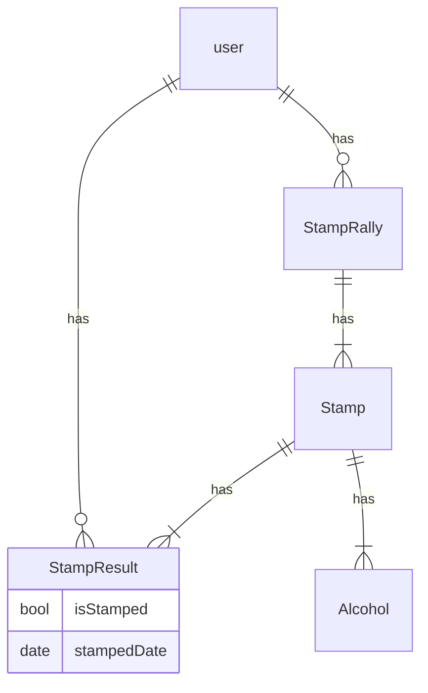

## DB概要

- アルコールはスクリプトは入れる

## スタンプラリーテーブル

| カラム名 | データ型 | 説明 |
| --- | --- | --- |
| id | int | 主キー |
| name | varchar | スタンプラリー名 |
| user_id | int | FK（ユーザID） |

## スタンプテーブル

| カラム名 | データ型 | 説明 |
| --- | --- | --- |
| id | int | 主キー |
| name | varchar | スタンプ名 |
| alcohol_id | int | FK（アルコールID） |
| stamp_rally_id | int | FK（スタンプラリーID） |

swaggerで書かれたり･･･(htmlで自動出力されるやつ)
## スタンプラリー作成API

- URL
  - /stamprallies
- Method
  - POST
- Request
  - no
- Response
  - id
    - 新規策作成したスタンプラリーID
- API要件
  - ランダムで４つのスタンプを紐づける